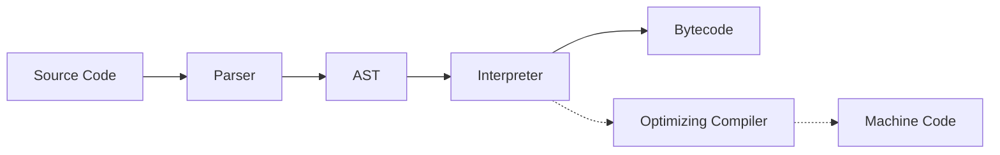

# 01 - Introduction to JavaScript (Deep Dive)

> **References & Standards:**
> *   [MDN Web Docs: JavaScript](https://developer.mozilla.org/en-US/docs/Web/JavaScript) (Official Documentation)
> *   [ECMA-262 Specification](https://tc39.es/ecma262/) (The Standard)

## 1. The Nature of JavaScript (ธรรมชาติของภาษา)
JavaScript เป็นภาษาที่มีความยืดหยุ่นสูงและมีความพิเศษเฉพาะตัว โดยมีนิยามทางเทคนิคดังนี้:

*   **High-level:** มนุษย์อ่านเข้าใจง่าย ไม่ต้องจัดการ Memory เอง (มี Garbage Collection)
*   **Dynamic Typed:** ไม่ต้องประกาศประเภทตัวแปร (Type) ล่วงหน้า เปลี่ยนประเภทไปมาได้
*   **Single-threaded:** ทำงานทีละคำสั่ง (Instruction) บน Thread เดียว
*   **Multi-paradigm:** รองรับทั้ง OOP (Object-Oriented) และ FP (Functional Programming)

> **🧠 Active Learning: Thought Experiment**
> ลองจินตนาการว่าถ้า JavaScript เป็น "Single-threaded" (มีคนทำงานคนเดียว) แล้วทำไมมันถึงสามารถรับ Request จากผู้ใช้หลายคนพร้อมกันได้โดยไม่ค้าง?
> *Hint: คำตอบอยู่ที่ "Asynchronous" และ "Event Loop" ซึ่งเราจะเรียนในบทหลังๆ*

## 2. Under the Hood: The Engine (เบื้องหลังการทำงาน)
คอมพิวเตอร์ไม่เข้าใจโค้ด JS ที่เราเขียนโดยตรง มันต้องผ่าน **JavaScript Engine** (เช่น **V8** ใน Google Chrome และ Node.js) เพื่อแปลงเป็น Machine Code

### JIT Compilation (Just-In-Time)
เดิมที JS เป็นภาษา **Interpreted** (แปลทีละบรรทัด) แต่ปัจจุบัน Engine ใช้เทคนิค **JIT Compilation**:
1.  **Parse:** อ่านโค้ดและแปลงเป็น AST (Abstract Syntax Tree)
2.  **Compile:** แปลง AST เป็น Bytecode (Interpreted) เพื่อรันทันที
3.  **Optimize:** ระหว่างรัน ถ้าเจอโค้ดที่รันบ่อยๆ (Hot code) จะแอบ Compile เป็น Machine Code ที่เร็วขึ้น (Optimized Machine Code)



### Stack & Heap (หน่วยความจำ)
Memory ใน JS Engine แบ่งเป็น 2 ส่วนหลัก:
1.  **Call Stack:** เก็บการทำงานของ Function และตัวแปรพื้นฐาน (Primitive) -> *เป็นระเบียบ*
2.  **Memory Heap:** เก็บข้อมูลขนาดใหญ่ เช่น Object, Array -> *ไม่เป็นระเบียบ (Unstructured)*

## 3. ECMAScript vs JavaScript
*   **ECMAScript (ES):** คือ "สเปค" หรือมาตรฐาน (Specification) ที่กำหนดว่าภาษาต้องทำอะไรได้บ้าง
*   **JavaScript (JS):** คือ "ภาษา" ที่นำสเปคนั้นมาสร้างจริง (Implementation)

| Version | Year | Key Features | Status |
| :--- | :--- | :--- | :--- |
| **ES5** | 2009 | `forEach`, `map`, JSON support, Strict Mode | Legacy Standard |
| **ES6 (ES2015)** | 2015 | `let`, `const`, Arrow Functions, Classes, Modules, Promises | **Major Milestone** |
| **ES2017+** | Yearly | `async/await` (ES2017), `xxn` (BigInt), etc. | Modern Standard |

## 4. Hello World Analysis
เรามาวิเคราะห์โค้ดพื้นฐานที่สุดกันแบบเจาะลึก:

```javascript
console.log("Hello, World!");
```

### 🔬 Deep Dive Analysis
คุณอาจจะตกใจถ้าผมบอกว่า **`console` ไม่ใช่คำสั่งของภาษา JavaScript!**

*   **Host Environment:** JS ไม่ได้ทำงานลอยๆ แต่มันอยู่ใน "บ้าน" (Host) เช่น Browser หรือ Node.js
*   **Web APIs / Node APIs:** เจ้าของบ้าน (Host) จะเตรียมเครื่องมือพิเศษไว้ให้เราใช้ เช่น `console`, `document` (Browser), หรือ `fs` (Node.js)
*   ดังนั้น `console.log` คือฟังก์ชันที่ **Environment** มอบให้ JS เรียกใช้ เพื่อคุยกับ Output Device นั่นเอง

## 5. Exercises: The Engineer Mindset
จงทดลองทำโจทย์ต่อไปนี้ตามลำดับความยาก (Difficulty Level):

### Level 1: Syntax Check (Easy)
โค้ดด้านล่างนี้มีจุดผิด 2 จุด ทำให้รันไม่ได้ จงค้นหาและแก้ไขให้ถูกต้อง
```javascript
Console.log("I'm learning JS");
console.log("It's fun!"
```

### Level 2: Predict & Verify (Medium)
โดยปกติ JavaScript รันโค้ดจากบนลงล่าง (Top-down)
ลองดูโค้ดนี้ แล้วทำนายซิว่าจะเกิดอะไรขึ้น?
```javascript
console.log("A");
// console.log("B");
console.log("C");
```
*   **Task:** เขียนลงในไฟล์ `ex01-2.js` แล้วรันด้วย `node ex01-2.js` เพื่อดูว่าตรงกับที่คิดไหม?

### Level 3: Crash the Stack (Hard) 💥
เราเรียนทฤษฎีเรื่อง Call Stack ไปแล้ว มาลองทำลายมันกันเถอะ!
ก๊อปปี้โค้ด "ระเบิดเวลา" นี้ไปรันดู (คำเตือน: นี่เป็นโค้ดสำหรับการศึกษาท่านั้น)

```javascript
// stack-crash.js
function bomb() {
    bomb(); // เรียกตัวเองซ้ำอีกรอบ
}
bomb();
```
*   **Task:** รันแล้วสังเกต Error Message ที่เกิดขึ้น มันบอกว่าอะไร? (ใบ้: เกี่ยวกับ ขนาดของ Stack)

### Level 4: Researcher (Challenge) 🏆
นอกจาก `console.log` แล้ว Environment ยังมีข้อมูลอื่นๆ ให้เราอีก
*   **Task:** จงเขียน code เพื่อแสดง **"Node.js Version"** ที่คุณใช้อยู่ ออกมาทางหน้าจอ โดยห้ามพิมพ์เลขเวอร์ชันเอง ใส่ String
*   **Hint:** ลองค้นหาใน Google ว่า `nodejs get version process`

---
👉 **[ดูเฉลย (Solutions)](/solutions/01-sol)**
